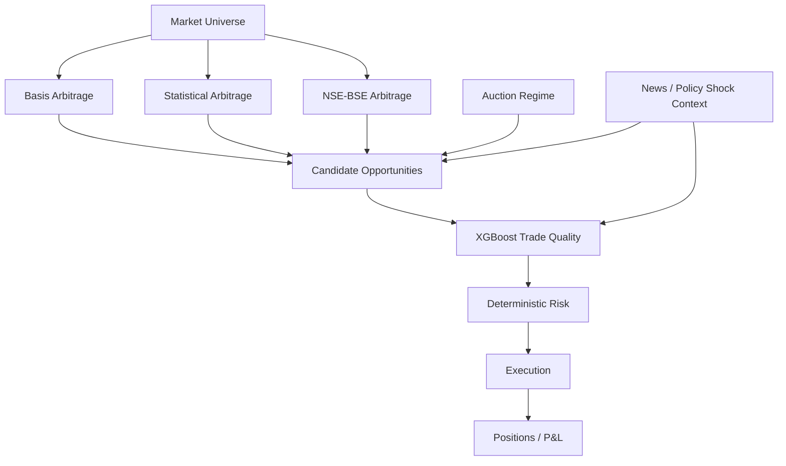

# META QUANT — Project Context for Humans and AI Agents

## One-paragraph mental model

META QUANT is not a generic stock-price predictor and not initially a live HFT product. It is a research-grade, multi-horizon relative-value trading platform for Indian markets. It looks for relationships between related instruments, estimates whether an apparent opportunity survives realistic trading costs and execution constraints, optionally uses ML/context information to rank opportunities, and then applies deterministic risk controls before simulated/paper/shadow execution.

## The five major ideas

1. **Relative value:** the system trades relationships, not an unconstrained belief that one stock will rise.
2. **Event-driven:** market changes arrive as events and propagate through market state, strategy, risk and execution.
3. **Execution realism:** gross spread is not profit; fills, costs, slippage, liquidity and latency matter.
4. **AI as evidence:** ML and Laya may provide scores/classifications; they do not own risk authority.
5. **Research before claims:** profitability and usefulness are hypotheses to be measured out-of-sample.

## Strategy map

## What is authoritative?

- Financial safety: deterministic risk rules.
- Historical truth: versioned datasets and event timestamps.
- Strategy mathematics: `STRATEGY_SPEC.md`.
- Runtime structure: `ARCHITECTURE.md`.
- Implementation constraints: `AGENTS.md`.

## What is intentionally not known yet?

- Final parameter values.
- Which strategy produces the best risk-adjusted result.
- Whether CAS produces a tradable edge.
- Whether news context improves results.
- Whether Laya improves the news/context layer enough to justify its compute cost.

Those questions are resolved by experiments, not by changing the architecture.
