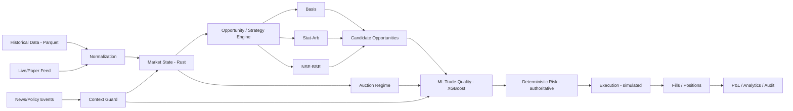

# META QUANT — Multi-Horizon Relative-Value Research & Trading Platform

> Event-driven, multi-horizon quantitative relative-value research platform for Indian markets, covering basis, statistical and cross-exchange arbitrage with cost-aware execution and ML-assisted analysis.

**Version:** 0.2 (Architecture Baseline)
**Status:** Architecture + scaffold; no strategy implementation yet
**Date:** 2026-09-24
**Reference Python:** 3.12.x · **Rust:** stable 2024 edition · **Platforms:** macOS ARM64, Linux x86-64
**License:** Apache-2.0 (see [LICENSE](LICENSE))

## What this is

META QUANT is an **event-driven, multi-horizon relative-value research and execution platform** for Indian equity and equity-derivatives markets. It studies relationships between related instruments, models whether an apparent edge survives realistic costs and execution constraints, optionally ranks opportunities with ML/context, and applies deterministic risk controls before simulated or paper/shadow execution.

**Primary research question:** after costs, slippage, latency, liquidity and two-leg execution risk, do the target relationships still yield a repeatable, risk-adjusted edge? (Answer is empirical, not assumed.)

## What this is not

- Not a generic directional stock predictor.
- Not a production HFT system and not exchange-colocated.
- Not a live-money trading bot in its initial scope (deferred behind `BrokerAdapter`).
- Not a microservice/Kafka/Redis/Kubernetes stack — deliberately minimal until measured need (ADR-007).
- Not a claim of profitability — every strategy result must state its cost/slippage/latency/liquidity/fill assumptions.

## Strategies (executable families)

| # | Family | Horizons | Note |
|---|---|---|---|
| A | **Spot-Futures Basis Arbitrage** | intraday + short-term (+ optional carry-to-expiry study) | Fair-value/carry vs observed basis; CAS-aware |
| B | **Cointegration / Statistical Arbitrage** | intraday + short-term + medium-term | Pairs/basket, hedge ratio, spread z-score, walk-forward |
| C | **NSE-BSE Cross-Exchange Arbitrage** | intraday | Simultaneous/near-simultaneous price difference; highly execution-sensitive |

Cross-cutting: **Market News & Policy Shock Guard** (regime disruption, not price prediction) and **Auction-Aware / CAS** (market-regime feature, not a fourth strategy). ML (XGBoost primary, LightGBM comparison) is a **trade-quality layer**, not a strategy (see `docs/ML_SPEC.md`, `docs/STRATEGY_SPEC.md`).

Holding periods are **configuration**, not globals (ADR-009).

## System architecture (one event model)



Backtest, paper, shadow, and future live share this model; only feed/execution adapters differ (ADR-003).

```
Market Data -> Normalization -> Market State -> Strategy -> Opportunity
  -> Trade Quality/Context -> Risk -> Execution -> Order -> Fill -> Position -> P&L/Audit
```

Core events: `MarketEvent`, `QuoteEvent`, `TradeEvent`, `OrderBookUpdate`, `AuctionEvent`, `NewsEvent`, `SignalEvent`, `OrderEvent`, `FillEvent`, `PositionEvent`, `RiskEvent`, `TimerEvent`, `SystemEvent`.

## Execution modes

| Mode | Data | Orders | Purpose |
|---|---|---|---|
| **BACKTEST** | historical (Parquet) | simulated | Deterministic replay; primary research |
| **PAPER** | live/current feed | simulated | Live data, no exchange submission |
| **SHADOW** | live/current feed | hypothetical, recorded | What-would-have-happened, no submission |
| **LIVE** | broker feed (future) | real (behind `BrokerAdapter`) | Deferred; requires separate approval |

Strategies contain no broker-specific code.

## Technology stack

| Area | Choice |
|---|---|
| Python | 3.12.x (`uv`, `pyproject.toml`, `uv.lock`) |
| Rust | stable, 2024 edition (`rust-toolchain.toml`, Cargo workspace) |
| Data (historical) | Parquet + DuckDB + Arrow; processing Polars+NumPy (pandas only via interop) |
| Operational state | PostgreSQL (orders, positions, experiment metadata, audit) |
| Statistics | NumPy, SciPy, statsmodels (state-space/Kalman), scikit-learn |
| ML | XGBoost primary; LightGBM optional comparison; no LSTM/Transformer without ADR |
| Runtime | Deterministic Rust event loop; Tokio for I/O/feeds/timers only |
| Python/Rust bridge | PyO3/maturin coarse-grained batch only — no per-tick callbacks (ADR-004) |
| API/control | FastAPI |
| Frontend | React + TypeScript + Vite (when built) |
| Testing | pytest + Hypothesis + cargo test + property + Criterion |
| Quality | Ruff + mypy + rustfmt + Clippy |
| Audit | pip-audit + cargo-audit/cargo-deny |
| Infra | Docker Compose initially; GitHub Actions CI |
| Observability | Structured logs from day 0; metrics early; Prometheus/Grafana later |

See `docs/TECH_STACK.md` and `docs/ARCHITECTURE.md` for rationale. Explicitly **not** in v0: Kafka, Redis, Kubernetes, Spark, Cassandra, TimescaleDB, FPGA, GPU cluster, colocation.

## Where docs live

- `docs/README.md` — doc map.
- `docs/SRS.md` — authoritative requirements (MQ-FR-xxx / MQ-NFR-xxx).
- `docs/ARCHITECTURE.md` — system map + plane separation + storage.
- `docs/WORKFLOWS.md` — backtest/paper/shadow/strategy/execution/risk/ML/news/auction flows.
- `docs/TECH_STACK.md` — pinned stack + deferred infra.
- `docs/DATA_SPEC.md` — time, entities, numeric representation, quality checks, leakage controls.
- `docs/STRATEGY_SPEC.md` / `EXECUTION_SPEC.md` / `RISK_SPEC.md` / `ML_SPEC.md` / `NEWS_SHOCK_SPEC.md` / `AUCTION_SPEC.md`
- `docs/INTERFACES.md` — feed, strategy, risk, execution, broker, context, regime contracts.
- `docs/OPERATIONS.md` / `SECURITY.md` / `CHANGE_CONTROL.md` / `EXPERIMENT_PLAN.md` / `DEVELOPMENT_PLAN.md` / `BEGINNER_GUIDE.md` / `GLOSSARY.md`
- `docs/ADR/` — 11 ADRs (do not silently override).
- `schemas/README.md` — canonical logical schemas; `configs/` — TOML examples (never secrets).

Start for a new agent: `README.md` -> `PROJECT_CONTEXT.md` -> `docs/SRS.md` -> `docs/ARCHITECTURE.md` -> relevant `*_SPEC.md` + `docs/ADR/*` -> `AGENTS.md`.

## Development quickstart

### Prerequisites

- Python 3.12.x (`uv` recommended; `.python-version` pinned)
- Rust stable (see `rust-toolchain.toml`)
- PostgreSQL 16+ (for operational state; not the tick lake)
- Node 20+ (frontend, when built)

### Setup

```bash
# Python (uv creates .venv, installs locked deps)
uv sync --all-extras --dev

# Rust (workspace build + clippy + tests)
cargo fmt --check
cargo clippy -- -D warnings
cargo test

# Python checks
uv run ruff check .
uv run mypy python/
uv run pytest -q

# Services (once implemented)
docker compose -f docker/docker-compose.yml up -d   # PostgreSQL
```

Environment secrets are never committed:
```bash
cp configs/paper.example.toml configs/paper.toml  # edit locally, not committed
# secrets via env: export BROKER_API_KEY=...  or .env (gitignored)
```

## Current implementation status

This is scaffold + specifications only (Phase 0). No trading logic, broker submission, XGBoost training, Laya integration, or dashboard is implemented. The next milestone is the deterministic end-to-end backtest vertical slice (see `docs/DEVELOPMENT_PLAN.md` Phase 3):

> historical data -> normalization -> event -> basis opportunity -> risk -> simulated order -> simulated fill -> cost -> position -> P&L -> deterministic replay

See `docs/EXPERIMENT_PLAN.md` for the staged question hierarchy (E1-E10).

## For AI agents

Read `AGENTS.md` before editing. Non-negotiables:

1. Read `PROJECT_CONTEXT.md` + `docs/SRS.md` + relevant specs/ADRs + existing tests.
2. Preserve `docs/INTERFACES.md` and `schemas/`; no silent architecture changes.
3. Rust hot path never calls Python per tick; batch boundary only.
4. Risk is authoritative; Laya never overrides limits or authorizes trades.
5. CAS is a regime, not a fourth strategy; ML is trade-quality, not a fourth strategy.
6. Tests mandatory; run `cargo test` + `uv run pytest` before done.
7. No unverified performance claims; benchmarks required.
8. No live-trading behaviour without explicit approval; default is BACKTEST/PAPER/SHADOW.
9. Update docs when behaviour changes; keep Mermaid diagrams consistent with text.

## License / disclaimer

Licensed under the Apache License, Version 2.0. See [LICENSE](LICENSE).

Research platform. Not investment advice; no profitability claim. See `docs/SECURITY.md` and `docs/SRS.md` for constraints.
