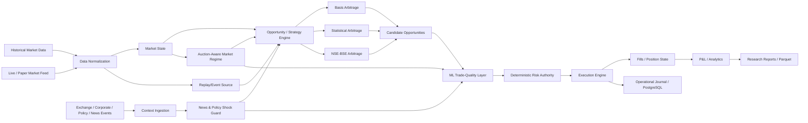
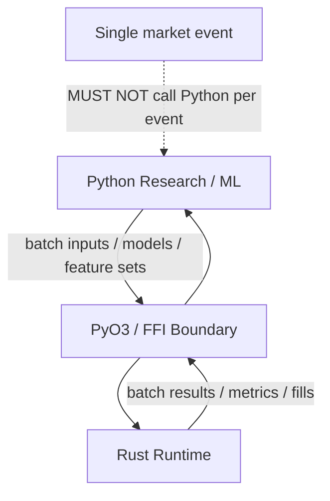
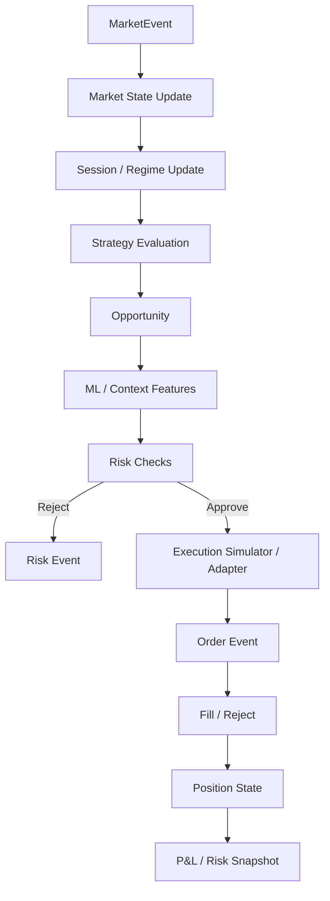

# META QUANT — System Architecture

## 1. Architectural principles

1. **Single conceptual event model:** feeds differ; strategy and risk contracts should not.
2. **Research/runtime separation:** Python is optimized for research velocity; Rust owns deterministic runtime behavior.
3. **Risk authority:** deterministic risk controls have veto power.
4. **Data separation:** analytical history and operational state use different storage mechanisms.
5. **Configuration over duplication:** strategy horizons and parameters are configuration, not copied engines.
6. **Evidence-driven performance:** optimize only after measurement.
7. **Graceful degradation:** optional ML/context modules may fail without corrupting the core.

## 2. System map



## 3. Plane separation

### Data plane
Moves and stores market/event data.

### Research plane
Python-based analysis, statistical models, feature engineering, training and experiments.

### Runtime plane
Rust-based event processing, market state, order/position state machines, execution simulation and deterministic risk checks.

### Control plane
FastAPI/UI and operational controls. It must not sit in the market-event hot path.

### Observability plane
Structured logs and metrics; Prometheus/Grafana are later operational surfaces rather than core trading dependencies.

## 4. Python ↔ Rust boundary



The boundary is intentionally coarse-grained.

## 5. Runtime event loop



## 6. Storage

```text
Historical / research data
    -> Parquet
    -> DuckDB
    -> Polars / NumPy / Python

Operational state
    -> PostgreSQL

Cross-language columnar interchange
    -> Apache Arrow

Hot runtime state
    -> native Rust structures
```

## 7. Key state boundaries

- Market state is not an order.
- A signal is not an order.
- An approved order is not a fill.
- A fill is not a realized P&L event until accounting rules apply.
- A model probability is not permission to trade.

## 8. Industry-practice alignment

The architecture intentionally separates research-oriented work from production/trading technology. Hudson River Trading publicly describes Trading Tech as focused on current trading activities and R&D as focused on historical research/data infrastructure, while Jane Street describes tightly integrated trading, research and technology and in-house critical trading/risk software. These public descriptions inform principles, not an assertion that META QUANT reproduces their proprietary architecture.

References:
- https://www.hudsonrivertrading.com/hrtbeat/engineering-and-interviewing-at-hrt/
- https://www.janestreet.com/what-we-do/overview/
- https://www.nseindia.com/static/market-data/real-time-data-subscription
