# META QUANT — Closing-Auction / Auction-Aware Specification

## 1. Current market-structure context

NSE currently describes a Closing Auction Session (CAS) from 3:15 PM to 3:35 PM for applicable cash-market securities. Equity derivatives continue trading until 3:40 PM. The CAS reference price is based on the 3:00–3:15 PM VWAP, and NSE disseminates auction-state information including indicative equilibrium price and quantities/imbalance data subject to the subscribed feed.

Reference: https://www.nseindia.com/static/products-services/closing-auction-session

## 2. Architecture role

CAS is a **market regime and feature subsystem**, not a fourth arbitrage strategy.

Primary initial strategy integration:

- Spot–Futures Basis Arbitrage.

Secondary research:

- NSE–BSE cross-exchange behavior around the cash closing transition.

## 3. Flow

```mermaid
flowchart TD
    A[3:00-3:15 cash trades] --> B[Compute reference/VWAP]
    B --> C[CAS regime begins]
    C --> D[Indicative equilibrium price]
    C --> E[Cumulative buy/sell quantities]
    C --> F[Imbalance]
    D --> G[Auction state]
    E --> G
    F --> G
    G --> H[3:35 final cash outcome]
    H --> I[3:35-3:40 derivatives]
    I --> J[Measure response/convergence]
    J --> K[Net-edge analysis]
```

## 4. Research hypothesis

Do not state that a profitable CAS arbitrage exists before testing it.

The test question is:

> After the cash auction outcome becomes observable, does the remaining derivative trading window exhibit a repeatable, cost-adjusted relationship to the auction-derived cash price or reference price?

## 5. Required data

At minimum, the experiment requires sufficiently granular data for:

- 3:00–3:15 trades for reference computation,
- CAS state/indicative prices where available,
- auction quantities/imbalance where available,
- final cash outcome,
- derivative prices from 3:35–3:40.

EOD-only data cannot support a detailed auction microstructure reconstruction.

## 6. Guardrails

- Keep settlement methodology configurable.
- Do not infer profitability from the existence of a 3:35–3:40 overlap.
- Do not claim HFT performance from minute-level data.
