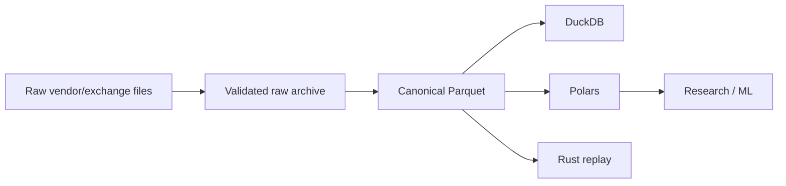

# META QUANT — Data Specification

## 1. Canonical time and currency

- **Canonical timestamp:** UTC. All persisted event timestamps are UTC (`event_timestamp_utc_ns`, `ingestion_timestamp_utc_ns`, `normalized_timestamp_utc_ns`). Venue-local time (IST) may be derived for session logic but must never replace the UTC canonical.
- **Timestamp precision:** **nanoseconds** (`u64` nanoseconds since UNIX epoch). All logical schemas store `*_timestamp_utc_ns: u64`.
- **Currency:** explicit instrument metadata. Every `Instrument` carries `currency` (e.g. `INR`); every price tick is denominated in that currency's minor unit via `tick_size`.
- **INR expectation:** `INR` is the expected currency for Indian equity/derivative instruments (`NSE`, `BSE`). The schema permits other currencies for future extensions but the default for this universe is `INR`.
- **Runtime prices:** integer tick representation (`price_ticks: i64`) where exchange metadata permits (`tick_size` → ticks). No binary floating-point for order-state/accounting.
- **Runtime quantities:** integer exchange units (`quantity: i64`, `lot_size: i64`). Fractional units are not used for execution state.
- **Tick size / lot size:** instrument metadata. `tick_size: Decimal` and `lot_size: i64` are part of `Instrument`; conversions (`ticks ↔ price`) use that metadata, not hard-coded constants.
- **Instrument-master source of truth:** **Open question.** The actual NSE/BSE instrument-master feed (file, API, vendor) is not yet selected. Do not invent the source; record the chosen source and its version/hash when decided.

The data contract shall distinguish at minimum:

- exchange/event timestamp (`event_timestamp_utc_ns`),
- ingestion timestamp (`ingestion_timestamp_utc_ns`),
- normalized/processing timestamp (`normalized_timestamp_utc_ns`).

This allows latency and stale-data conditions to be measured rather than assumed.

## 2. Core entities

```text
Instrument
MarketEvent
Quote
Trade
OrderBookUpdate
AuctionState
Opportunity
Signal
Order
Fill
Position
RiskSnapshot
PnlSnapshot
ContextEvent
```

## 3. Execution numeric representation

Research/ML calculations may use `float64`/NumPy floating-point values.

Execution-critical price/quantity state **must** use integer representations where exchange metadata permits:

- **Prices:** `price_ticks: i64` (ticks = `price / tick_size`). `tick_size` is `Instrument` metadata.
- **Quantities:** `quantity: i64` and `lot_size: i64` in exchange units.
- **Currency:** `currency` is explicit on `Instrument` (expected `INR` for NSE/BSE); not inferred.
- **Precision:** timestamps are `u64` nanoseconds; do not truncate to milliseconds/seconds for storage.

This reduces ambiguity from binary floating-point arithmetic in order-state and accounting logic (`SRS.md` MQ-FR-016).

## 4. MarketEvent example

```text
MarketEvent
    event_id
    event_type
    event_timestamp_utc_ns
    ingestion_timestamp_utc_ns
    exchange
    segment
    instrument_id
    sequence_number (nullable)
    payload
```

## 5. Quote example

```text
Quote
    instrument_id
    exchange
    timestamp
    bid_price_ticks
    bid_quantity
    ask_price_ticks
    ask_quantity
```

## 6. AuctionState example

```text
AuctionState
    instrument_id
    exchange
    timestamp
    session_type
    reference_price
    indicative_equilibrium_price
    indicative_tradable_quantity
    cumulative_buy_quantity
    cumulative_sell_quantity
    imbalance_quantity
    imbalance_side
    status
```

The exact availability of these fields depends on the subscribed data feed and data product. The implementation must not fabricate fields that are absent from the source data.

## 7. Storage architecture



## 8. Data quality checks

At ingestion time, validate:

- timestamps are parseable and ordered where expected,
- prices are non-negative and respect valid tick sizes where applicable,
- quantities are non-negative and integer-valued where applicable,
- instrument identifiers resolve to current metadata,
- duplicate/sequence anomalies are detectable,
- exchange/session boundaries are represented,
- missingness is measured rather than silently filled.

## 9. Historical data leakage controls

A backtest must not use:

- future quotes,
- future auction outcomes,
- future corporate actions that were not available at the decision time,
- post-trade information for the entry decision,
- revised data without an audit of the revision policy.

## 10. Source quality

NSE currently provides multiple levels of real-time data, including Level 1, Level 2, Level 3 and tick-by-tick feeds; Level 1 provides best bid/ask, Level 2 up to five best bid/ask levels, Level 3 up to twenty levels, and tick-by-tick provides the full order book. The exact feed available to META QUANT determines which microstructure experiments are valid.

Reference: https://www.nseindia.com/static/market-data/real-time-data-subscription
