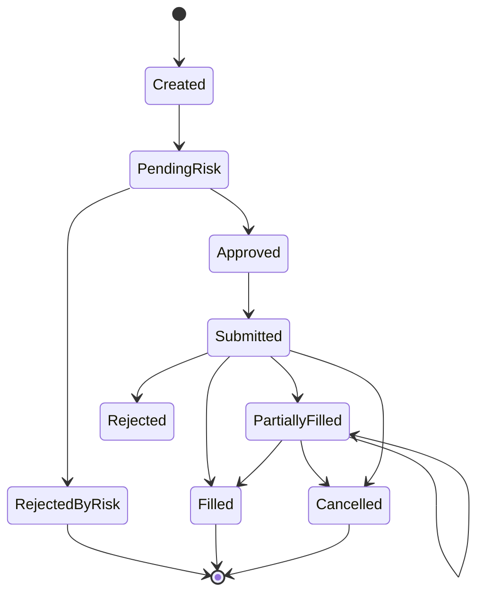
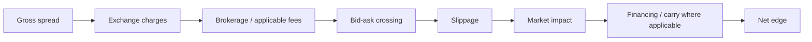
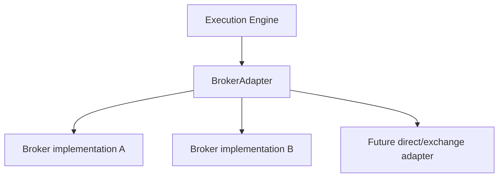

# META QUANT — Execution Specification

## 1. Purpose

The execution layer converts an approved signal into simulated or future broker-routed orders while modelling the difference between theoretical and realizable trading.

## 2. Order lifecycle



## 3. Two-leg execution

For arbitrage strategies, treat each hedge as a logical parent trade containing two child legs.

```text
ArbitrageOrder
    parent_id
    leg_A
    leg_B
    max_legging_time
    hedge_policy
    execution_status
```

The engine must represent partial/failure states explicitly rather than assuming atomic fills.

## 4. Fill model

At minimum support:

- market/limit semantics as defined by the simulation,
- queue/liquidity assumptions,
- partial fills,
- rejected orders,
- slippage,
- latency,
- market impact assumptions,
- cancellation/timeout.

## 5. Cost model



The exact charge schedule is configuration/data, not hard-coded strategy mathematics.

## 6. Latency model

Where historical timestamps permit, separate:

- market-event timestamp,
- ingestion time,
- strategy decision time,
- simulated order submission time,
- simulated acknowledgement time,
- simulated fill time.

Do not claim live exchange latency from a historical dataset that cannot support it.

## 7. Broker abstraction



Strategy code shall not depend directly on a broker-specific SDK.
