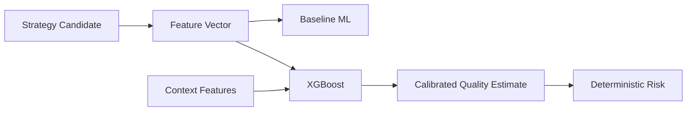
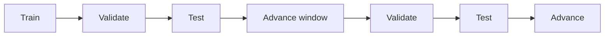
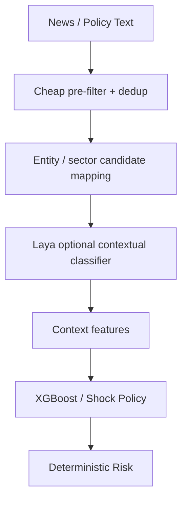

# META QUANT — Machine Learning Specification

## 1. ML purpose

ML is a **trade-quality/meta-model layer**. It does not replace the strategy mathematics.

The baseline flow is:

## 2. Primary model

XGBoost is the primary model because the immediate problem is tabular supervised prediction over structured opportunity features.

Candidate features include:

- spread/basis,
- z-score,
- recent convergence speed,
- volatility,
- bid/ask spread,
- depth/liquidity,
- volume,
- open interest,
- time to expiry,
- time of day,
- market regime,
- news/policy context,
- auction state where relevant.

## 3. Baselines

Before declaring an ML improvement, compare against:

- rule-only strategy,
- logistic regression or simple classifier,
- XGBoost,
- optionally LightGBM.

A more complex model must demonstrate incremental value out-of-sample.

## 4. Label design

The label must represent an explicitly defined future outcome that could have been observed after the decision point, for example:

- net-positive trade after modeled costs,
- probability of convergence before timeout,
- future net return over a fixed horizon.

Labels must never include information that would not have been available at decision time.

## 5. Calibration

Raw model scores are not automatically probabilities. Calibration must be measured and, if needed, fitted on an appropriate validation procedure.

## 6. Walk-forward validation

The final reported result aggregates strictly out-of-sample periods.

## 7. Laya integration

Laya is an optional contextual decision model, not the primary numerical trading model.

Use cases:

- news/event family classification,
- event materiality classification,
- affected entity/sector classification,
- contextual uncertainty signal.

Do not use Laya for:

- position sizing authority,
- exposure limits,
- kill-switch decisions,
- direct order authorization,
- numerical market-state estimation when a deterministic/statistical method is appropriate.

## 8. Laya architecture

## 9. Batched inference

Where multiple contextual questions are evaluated for the same event, use batching rather than repeated independent model calls when the runtime supports it. Keep the question set small and hierarchical; do not create a large flat classification space.

## 10. Failure handling

Laya failure shall produce an explicit `context_unavailable` state. It must not corrupt strategy accounting or cause an unsafe order.
