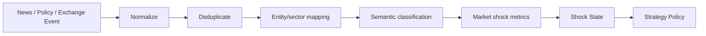

# META QUANT — Market News & Policy Shock Guard

## 1. Problem

A sudden information event can invalidate the historical statistical relationship on which a relative-value strategy depends. The system therefore needs to identify information shocks and determine whether existing opportunities should be restricted or re-evaluated.

## 2. What is measured

The system must avoid claiming to measure trader emotion. It measures observable proxies:

- volatility jump,
- abnormal volume,
- spread widening,
- liquidity deterioration,
- price gap,
- correlation/cointegration instability,
- order-book abnormalities,
- semantic event relevance/materiality.

## 3. Pipeline



## 4. Laya role

Laya may classify contextual properties. The model is evidence, not authority.

Example output contract:

```text
EventClassification
    event_type
    affected_entities[]
    affected_sectors[]
    materiality_class
    uncertainty_score
    model_version
    timestamp
```

## 5. Shock policy

A strategy may move from `NORMAL` to `WATCH`, `RESTRICT`, or `SUSPEND_NEW_ENTRIES` when defined quantitative and contextual thresholds are exceeded.

The policy shall be instrument/sector aware where possible.

## 6. Research questions

- Do contextual signals reduce adverse entries?
- How many good trades are rejected?
- Does shock filtering improve risk-adjusted P&L?
- Does adding Laya context improve over numeric shock detection alone?

The feature is accepted based on measured benefit, not on the assumption that every news event is harmful.
