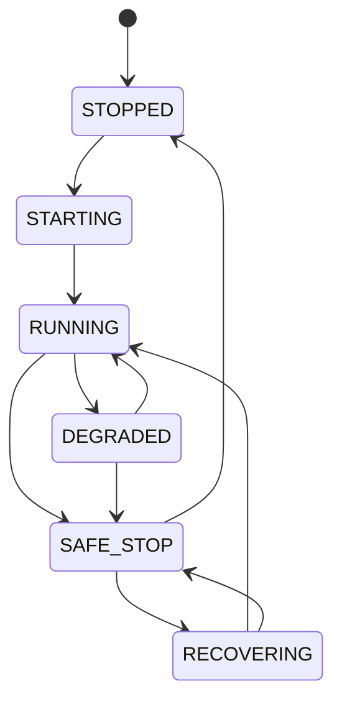

# META QUANT — Operations and Reliability

## 1. Operational states

## 2. Startup

1. Validate configuration.
2. Validate model/data versions.
3. Load instrument/session metadata.
4. Restore/replay durable operational state if required.
5. Validate risk limits.
6. Connect to the selected feed.
7. Start the event loop.

## 3. Runtime integrity checks

Monitor:

- feed heartbeat/staleness,
- sequence gaps where a sequence is supplied,
- impossible price/quantity states,
- database availability,
- model availability,
- clock quality,
- risk-state consistency.

## 4. Recovery

A restartable runtime should be able to reconstruct state from the durable event/order/position record without trusting an in-memory snapshot as the sole source of truth.

## 5. Fail-closed behavior

Critical failures stop new risk-taking first. The system should retain enough state for reconciliation and diagnosis.

## 6. Operational evidence

Every paper/shadow run should be identifiable by:

- run ID,
- Git SHA,
- config hash,
- dataset/feed version,
- model versions,
- start/end time,
- runtime host.
