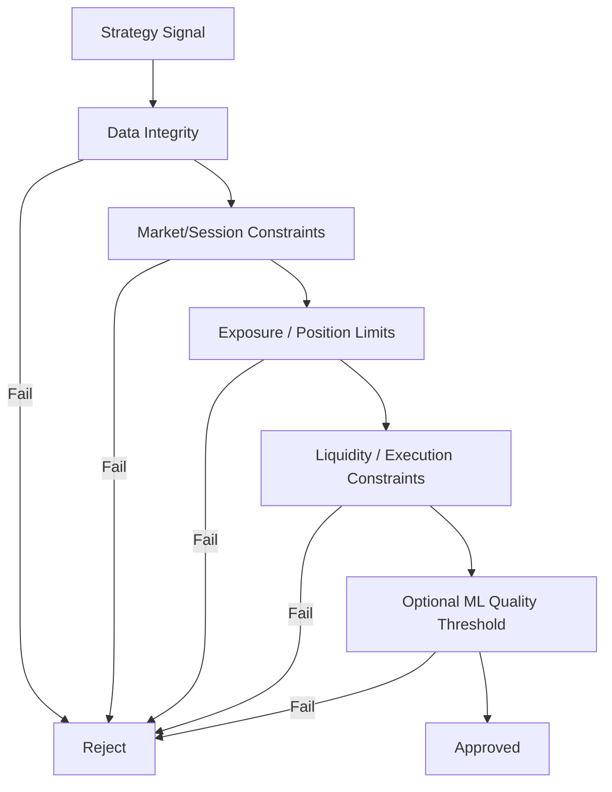

# META QUANT — Risk Specification

## 1. Principle

Risk controls are deterministic and authoritative. They are separate from the ML/trading-signal layer.

## 2. Risk checks

At minimum the architecture shall support:

- maximum position size,
- maximum gross exposure,
- maximum net exposure,
- per-instrument limits,
- per-strategy limits,
- maximum notional per order,
- maximum simultaneous opportunities,
- maximum daily loss (where applicable),
- stale-data checks,
- liquidity checks,
- execution-legging timeouts,
- model/input integrity checks,
- global kill switch.

## 3. Decision hierarchy



The diagram is deliberately asymmetric: ML is one criterion, not the final safety authority.

## 4. Shock guard interaction

The news/policy shock subsystem may produce states such as:

```text
NORMAL
WATCH
RESTRICT
SUSPEND_NEW_ENTRIES
RECOVERY
```

A shock state may restrict strategies by instrument/sector/regime. It must not automatically suspend the entire market without a policy rule that justifies the scope.

## 5. Fail-closed behavior

Critical integrity failures shall prevent new risk-taking and preserve the ability to reconcile current state.
