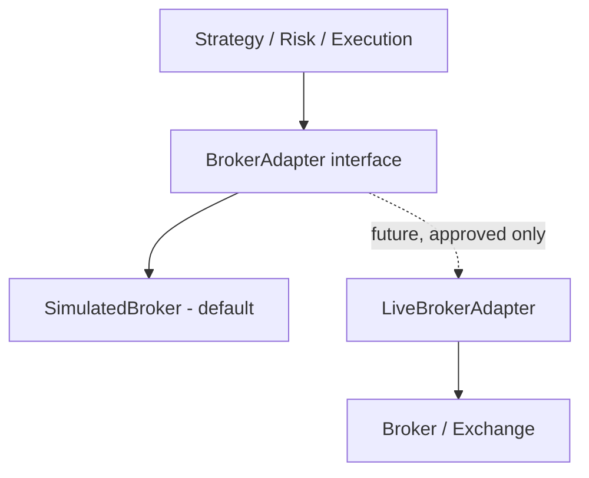

# META QUANT — Security Baseline

**Version:** 0.2
**Date:** 2026-09-24
**Related:** docs/SRS.md MQ-NFR-007, docs/INTERFACES.md sec 8, docs/OPERATIONS.md

## 1. Rules

- No credentials in Git (API keys, broker credentials, tokens). Enforced by `.gitignore` + pre-commit check.
- No broker API keys in experiment notebooks or configs. Secrets via environment variables / secret manager.
- No secrets inside Docker images. Build args must not bake secrets.
- Separate research credentials from any operational credentials; future live adapter uses a dedicated restricted role.
- Default runtime has **no live-order authority** (BACKTEST/PAPER/SHADOW only). `BrokerAdapter` live implementation requires explicit approval.
- Validate external event inputs (news/policy feeds) before use; treat as untrusted input.
- Pin and audit dependencies: `pip-audit` + `cargo-audit` / `cargo-deny`; CI fails on high-severity advisories.
- Record administrative/control actions (who, what, when, config hash) in the operational journal.
- Least-privilege file and DB permissions; PostgreSQL roles scoped per service.

## 2. Secret handling

```text
# .env (never committed)
BROKER_API_KEY=...
NEWS_FEED_TOKEN=...

# config (TOML) references env, not values
[broker]
api_key_env = "BROKER_API_KEY"
mode = "paper"  # backtest | paper | shadow (live requires ADR)
```

`configs/*.example.toml` contain placeholders only.

## 3. Live boundary



The repository must keep the future live-trading adapter behind this boundary. Default configuration runs in BACKTEST/PAPER/SHADOW.

## 4. Operational security

- Structured logs redact secrets.
- Dependency audit runs in CI (`pip-audit`, `cargo deny check`).
- Container images run as non-root; no host credential mounts by default.
- Recovery/replay does not re-expose secrets in logs or artefacts.

## 5. Reporting

Security issues are tracked as `SECURITY` label. Never file real credentials in issues or ADRs.

## Open questions

- Secret-manager choice (env-only vs Vault/AWS SM) deferred until operational deployment; interface remains env-var compatible.
