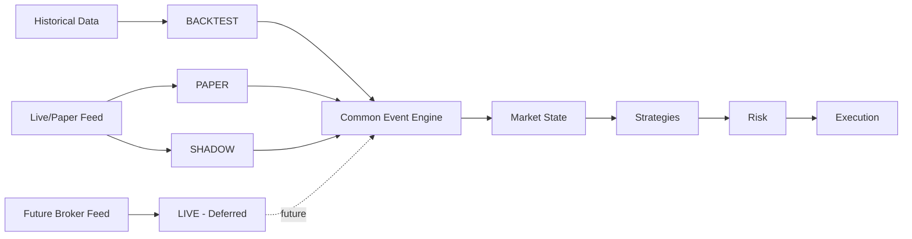

# META QUANT — Software Requirements Specification (SRS)

**Version:** 0.2
**Status:** Architecture baseline / implementation authority
**Date:** 2026-09-24

## 1. Purpose

META QUANT shall provide a reproducible, event-driven platform for researching and evaluating relative-value trading strategies in Indian equity and equity-derivatives markets. The system shall separate market-data handling, strategy logic, contextual information, machine learning, execution simulation, risk controls and analytics so that each part can be independently tested and audited.

The initial goal is **research-grade and paper/shadow-grade correctness**, not immediate live-money deployment.

## 2. Scope

### 2.1 Core strategies

1. Spot–Futures Basis Arbitrage
2. Cointegration / Statistical Arbitrage
3. NSE–BSE Cross-Exchange Arbitrage

ML is a trade-quality / contextual layer, not a fourth strategy (ADR-009, ML_SPEC).
Auction/CAS is a market-regime / feature subsystem, not a fourth strategy (ADR-010).

### 2.2 Cross-cutting intelligence/risk capabilities

4. Market News & Policy Shock Guard (ADR-011, NEWS_SHOCK_SPEC)
5. Auction-Aware Market Regime / Convergence Analysis (ADR-010, AUCTION_SPEC)

The latter two do not constitute additional standalone arbitrage strategies.

## 3. Execution modes

### BACKTEST (MQ-FR-008 context)
Historical data is replayed through the same conceptual event model used by runtime modes. Orders are simulated. Deterministic replay required (ADR-003).

### PAPER
Live or delayed market data may be used, but no live exchange order is submitted. Orders are simulated. Strategies contain no broker-specific code.

### SHADOW
The system behaves as though it were deciding and routing trades, recording hypothetical orders/fills, but submits no live order.

### LIVE
Deferred. Any future implementation must sit behind `BrokerAdapter` (`docs/INTERFACES.md`) and undergo separate regulatory, broker, operational and risk approval.

## 4. Functional requirements

| ID | Title | Description | Trace |
|---|---|---|---|
| MQ-FR-001 | Data ingestion | The system shall ingest normalized historical and live/paper market data through abstract feed interfaces (`MarketDataProvider`). Historical is Parquet/Arrow; operational is not the tick lake. | DATA_SPEC, ARCH sec 2, ADR-002 |
| MQ-FR-002 | Market state | The runtime shall maintain the latest valid state required by strategies, including quotes, trades, order-book state where available, auction state where available, instrument metadata and timestamps. Hot state is native Rust structures. | DATA_SPEC, INTERFACES sec 2 |
| MQ-FR-003 | Strategy interface | Every strategy shall implement a common strategy contract so it can operate against historical replay, paper and shadow feeds without rewriting logic. Horizon is a configuration property (ADR-009). | STRATEGY_SPEC sec 1 |
| MQ-FR-004 | Opportunity generation | Strategies shall produce explicit opportunity/signal objects containing the assumptions and market state needed to audit the decision. | INTERFACES sec 4, STRATEGY_SPEC |
| MQ-FR-005 | Cost-aware evaluation | No executable result shall be considered net-positive solely because raw spread > 0. Transaction costs, spread crossing, slippage, financing/carry, market impact and execution uncertainty shall be explicit. Separate gross edge from net executable edge. | EXECUTION_SPEC sec 5 |
| MQ-FR-006 | Risk authority | All candidate orders shall pass through deterministic risk controls before execution. Risk has veto; models are advisory. | RISK_SPEC, ADR-006 |
| MQ-FR-007 | Execution simulation | The system shall support simulated fills, partial fills, order rejection, latency and two-leg/legging risk per selected execution model. | EXECUTION_SPEC sec 2-4 |
| MQ-FR-008 | Position/P&L accounting | Positions, realized/unrealized P&L, cash/margin assumptions and transaction costs shall be recorded separately from signal generation. Numeric representation: integer ticks/quantities for accounting; float64 for statistics/ML. | DATA_SPEC sec 3 |
| MQ-FR-009 | Replay | A recorded event sequence shall be replayable deterministically under the same engine version and configuration. Same event model across modes. | ARCH sec 5, ADR-003 |
| MQ-FR-010 | News/policy context | The system shall optionally ingest external event/news records and classify them. A contextual model (optionally Laya via `ContextClassifier`) may contribute features, but hard risk remains deterministic. Core system runs if Laya unavailable. | NEWS_SHOCK_SPEC, ADR-008/011 |
| MQ-FR-011 | Auction-aware analysis | The system shall represent the closing-auction regime separately from continuous trading and support research into cash-auction vs derivative behaviour. Market rules are configurable. | AUCTION_SPEC, ADR-010 |
| MQ-FR-012 | ML trade-quality layer | The ML subsystem shall consume candidate opportunities + contextual/market features and estimate trade quality / expected net outcome. Not generic price prediction. Primary: XGBoost; experimental: LightGBM. No LSTM/Transformer unless explicit ADR. | ML_SPEC |
| MQ-FR-013 | Experiment reproducibility | Each experiment shall record: experiment ID, Git commit, dataset/version, time range, strategy version, config/config-hash, model version/hash, random seed, train/validate/test windows, execution-model and cost-model versions, hardware/runtime context, results. No `final_final2.csv`. | AGENTS sec 6 |
| MQ-FR-014 | Observability | The system shall produce structured logs and operational metrics sufficient to diagnose data, strategy, execution and risk behaviour. Metrics are Prometheus-compatible later. | OPERATIONS |
| MQ-FR-015 | Broker abstraction | Broker-specific functionality shall be isolated behind `BrokerAdapter` interfaces. Strategies shall not contain broker SDK code. | INTERFACES sec 8 |
| MQ-FR-016 | Numeric representation | Runtime accounting quantities shall use integer ticks / fixed-point and integer quantities with explicit units/currency/timestamp precision; float64 is for research/ML only. | DATA_SPEC sec 3, TECH_STACK |
| MQ-FR-017 | Configuration | Canonical configuration format is TOML; secrets never committed; limits are configuration not hard-coded. | configs/README.md, RISK_SPEC |

## 5. Non-functional requirements

| ID | Title | Description |
|---|---|---|
| MQ-NFR-001 | Correctness | Financial accounting and event ordering shall be deterministic and testable. |
| MQ-NFR-002 | No look-ahead | Historical decisions shall only use information available at the decision timestamp; leakage tests required. Survivorship-bias/universe-change handling documented. |
| MQ-NFR-003 | Reproducibility | Repeated replay with same inputs shall produce equivalent outputs; see MQ-FR-013. |
| MQ-NFR-004 | Performance (benchmark-driven) | Performance claims require Criterion / pytest-benchmark with workload + environment record. No premature Rust migration. |
| MQ-NFR-005 | Portability | First-class on macOS ARM64 and Linux x86-64; no Ubuntu-only paths; cross-platform config; Docker not required for every task. |
| MQ-NFR-006 | Resilience | Paper/shadow runtime shall fail closed on critical integrity/risk failures and support restart/recovery from durable state (PostgreSQL journal). |
| MQ-NFR-007 | Security | Credentials never in Git; secrets via environment/secret mechanisms; future live adapter isolated; deps pinned/audited. |
| MQ-NFR-008 | Auditability | Signals, model outputs, risk decisions, orders, fills and config versions shall be traceable end-to-end. |
| MQ-NFR-009 | Deterministic risk | Risk controls remain deterministic and authoritative; no AI override; see ADR-006. |
| MQ-NFR-010 | No premature infra | No Kafka/Redis/Kubernetes/Spark/etc without ADR + measured need (ADR-007). |

## 6. Horizon requirements

| Strategy | Primary horizon | Notes |
|---|---|---|
| NSE–BSE | Intraday | Short-lived; execution/timestamp sensitive |
| Basis | Intraday + short-term | May include convergence and carry-to-expiry experiments |
| Statistical arbitrage | Intraday + short-term + medium-term | Horizon determined by measured spread dynamics |
| News guard | All | Context/risk layer, not a holding-period strategy |
| Auction-aware | Late-session/intraday | Regime/feature applied to relevant strategies |

Holding periods are strategy/configuration properties, not hard-coded globally (ADR-009).

## 7. Hard constraints on AI/model use

- LLM/System-1 (Laya) outputs shall never directly authorize an order (ADR-008).
- Model confidence shall never override hard risk limits (ADR-006).
- Model unavailability shall not corrupt accounting or cause uncontrolled order behavior.
- Every model contribution shall be versioned and reproducible (MQ-FR-013).
- Laya must not: override limits, determine position size, bypass kill switches, or control order submission.

## 8. Explicit non-goals

- No claim of production HFT capability.
- No exchange colocation requirement for the research system.
- No long-term directional equity prediction as the primary problem.
- No GPU cluster / LSTM / Transformer requirement unless explicit experiment justifies it.
- No microservice architecture unless a measured need emerges.
- No live-money trading in the initial scope.
- No Kafka/Redis/Kubernetes/Spark/Hadoop/Cassandra/TimescaleDB/FPGA.
- Do not make old FilterPy a required core dependency; use statsmodels state-space where practical (TECH_STACK).

## 9. Acceptance principles

A subsystem is accepted only when:

1. Its mathematical/behavioral contract is documented.
2. Its interfaces are implemented.
3. Its tests cover normal and failure behavior.
4. It can participate in deterministic replay where applicable.
5. Its outputs can be traced to inputs and configuration.
6. Any performance claims are benchmarked.

## 10. Traceability

See `docs/REQUIREMENT_TRACEABILITY.md` for FR/NFR -> spec -> ADR -> implementation -> validation mapping.
