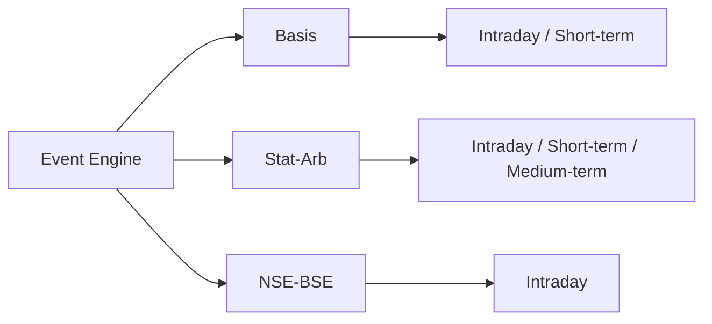

# META QUANT — Strategy Specification

## 1. Common strategy contract

Every strategy shall expose conceptually:

```text
initialize(config, instruments)
update(market_event, market_state)
evaluate(timestamp, market_state)
handle_fill(fill)
handle_session_change(session_state)
reset()
```

The concrete language interface may differ, but semantics must remain stable across Python research and Rust runtime components.

## 2. Strategy 1 — Spot–Futures Basis Arbitrage

### Objective
Identify deviations between observed futures pricing and a defined fair-value/carry relationship.

### Modes
- intraday convergence,
- short-term convergence,
- optional carry-to-expiry research.

### Inputs
- spot price/quote,
- futures price/quote,
- contract expiry,
- interest/carry assumptions,
- dividends where applicable,
- liquidity,
- execution costs.

### Outputs
- observed basis,
- fair basis,
- deviation,
- estimated net edge,
- candidate trade direction,
- expected horizon.

## 3. Strategy 2 — Cointegration / Statistical Arbitrage

### Research steps

1. Define eligible universe.
2. Select candidate relationships.
3. Test stationarity/cointegration.
4. Estimate hedge ratio.
5. Construct spread.
6. Estimate rolling statistics.
7. Generate entry/exit signals.
8. Evaluate cost-adjusted P&L.
9. Re-test stability under walk-forward periods.

### Optional dynamic hedge ratio
A Kalman/state-space implementation may be evaluated against static/rolling hedge ratios.

## 4. Strategy 3 — NSE–BSE Cross-Exchange Arbitrage

### Objective
Test whether simultaneous or near-simultaneous price differences between NSE and BSE are executable after costs and two-leg execution risk.

### Required conditions
- reliable timestamp alignment,
- tradability on both venues,
- adequate displayed/estimated liquidity,
- spread greater than expected full cost,
- bounded legging risk.

### Default horizon
Intraday.

## 5. Multi-horizon design

A strategy object is independent of the global engine clock. Horizon is strategy/configuration metadata.



## 6. Closing-auction extension

The closing-auction subsystem is a **market-regime input** and strategy extension, not a fourth strategy.

Primary initial use:
- Basis arbitrage.

Secondary research:
- NSE–BSE relationships around the auction transition.

## 7. News/policy shock extension

News/policy context is not a strategy. It changes the admissibility/quality of existing strategy opportunities.
