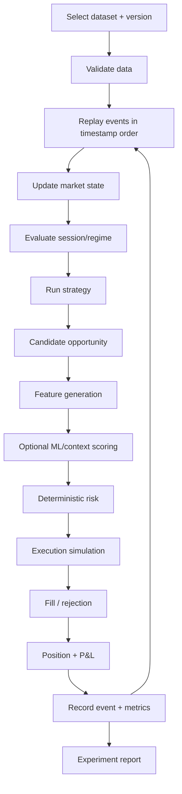
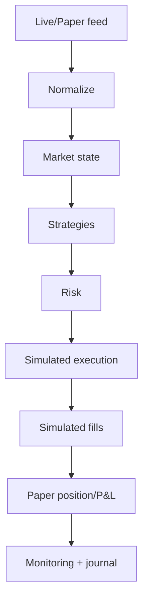
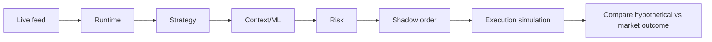
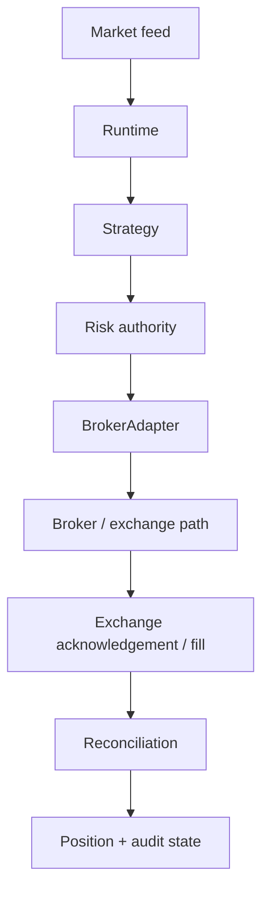
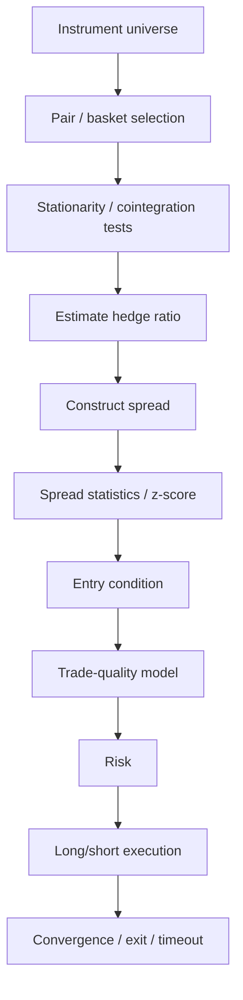
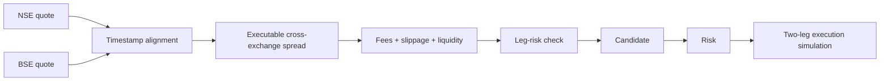
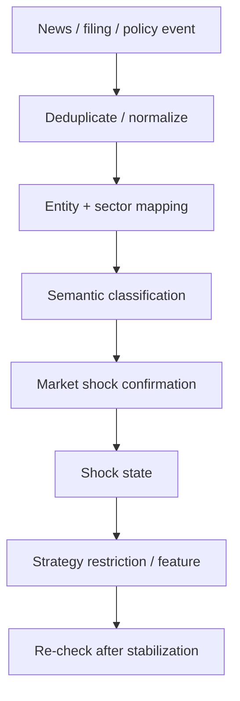
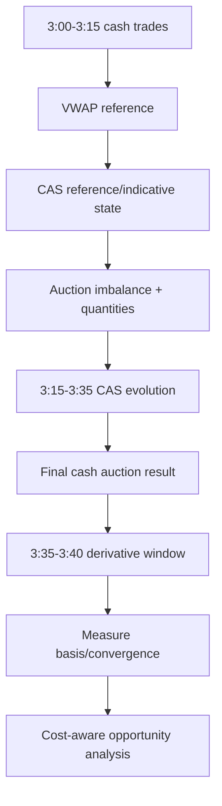
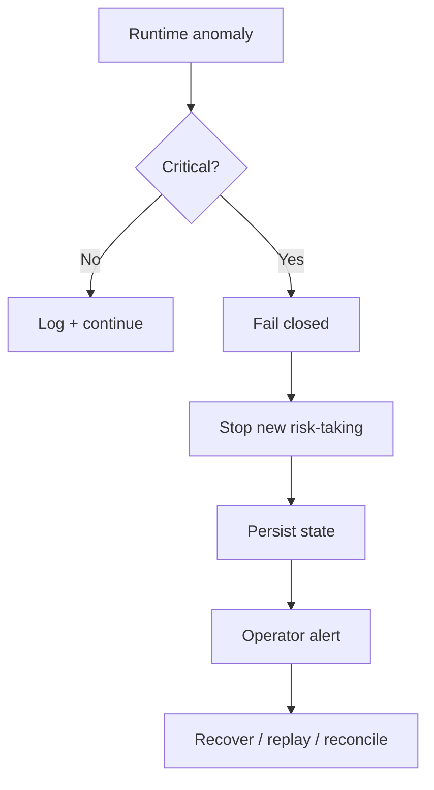

# META QUANT — End-to-End Workflows

This document explains what happens in the system, step by step, without assuming prior quant-engineering knowledge.

## 1. Historical backtest workflow

## 2. Paper workflow

No live order is submitted.

## 3. Shadow workflow

Shadow mode is more operationally realistic than paper mode because it exercises decision and routing logic against the live environment while preventing actual order submission.

## 4. Future live workflow

Live trading is deferred and must be separately approved.

## 5. Basis arbitrage workflow

```mermaid
flowchart LR
    A[Spot + futures state] --> B[Fair-value / carry model]
    B --> C[Observed basis]
    C --> D[Deviation]
    D --> E[Cost + slippage estimate]
    E --> F[Candidate]
    F --> G[Optional auction/context features]
    G --> H[ML quality score]
    H --> I[Risk]
    I --> J[Two-leg execution simulation]
    J --> K[Convergence / exit]
```

## 6. Statistical arbitrage workflow

## 7. NSE–BSE workflow

This strategy is primarily intraday and extremely sensitive to timestamp quality and execution assumptions.

## 8. News/policy-shock workflow

### Example

A policy announcement may be classified by the contextual model as relevant to the automotive sector. Quantitative measurements then confirm whether volatility, spread width, volume, correlation or liquidity also changed materially. The resulting shock state may reduce or suspend new entries in affected strategies.

## 9. Closing-auction workflow

This is initially an event-study/research feature. The system must not assume profitability in advance.

## 10. Failure workflow

